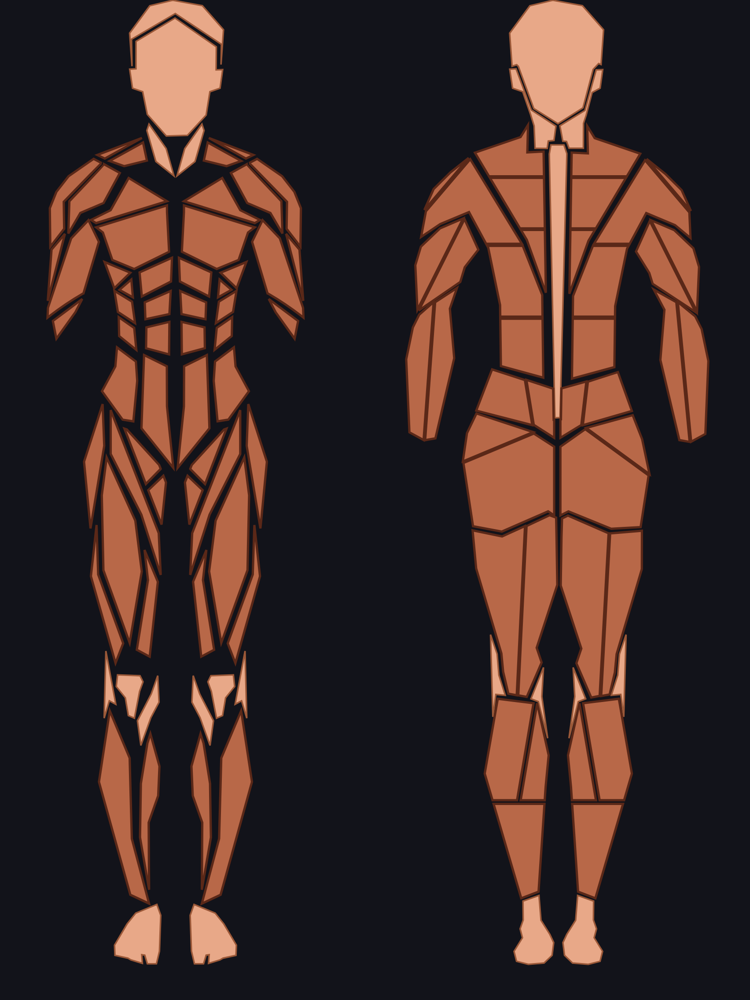
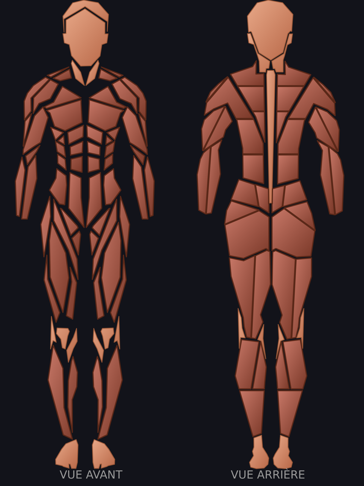
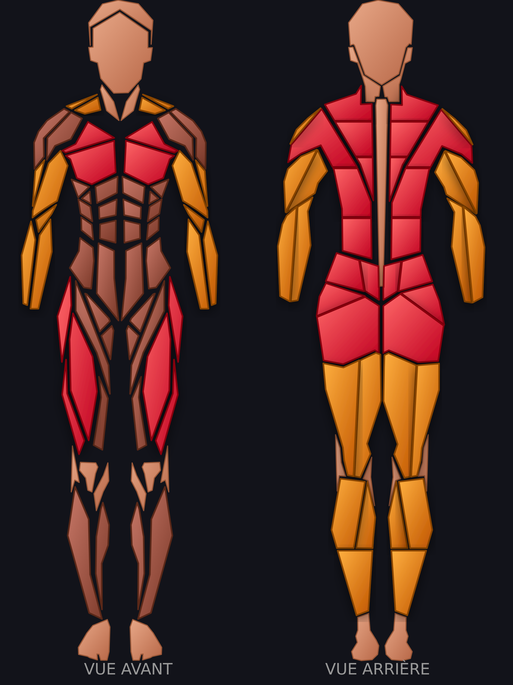

# 🧍‍♀️ Figurine féminine — ce qu'il faut fournir

> Document à transmettre tel quel à qui fournira l'illustration (banque d'images médicales,
> illustrateur, outil de maquettage). Généré depuis le code de Force Tracker le 03/08/2026.

## ⚡ Le plus simple : partir du GABARIT

Un fichier **`figurine-gabarit.svg`** accompagne ce document. C'est un **formulaire déjà
étiqueté** : les 82 emplacements portent leur nom définitif et leurs attributs, et **66 sont
déjà dessinés** (repris de la figurine actuelle). **Il ne reste que 16 formes à créer.**

**Les 16 à dessiner** — tout le reste est fourni :

| Muscle | Ce qu'il faut faire |
|---|---|
| `pectoralis_middle` (×2) | subdiviser le pectoral existant en trois bandes |
| `rectus_middle` (×2) | idem pour le grand droit |
| `vastus_lateralis`, `vastus_medialis` (×4) | subdiviser le quadriceps existant en trois |
| `brachialis` (×2) | une bande sous le biceps |
| `oblique_internal` (×2) | sous l'oblique externe existant |
| `rhomboid` (×2) | entre les omoplates |
| `teres_major` (×2) | sous l'arrière de l'épaule |

**Règle absolue : ne rien renommer.** Les identifiants et les attributs `data-*` sont ce qui
permet à l'application de savoir quoi colorier.

**Le fichier rendu se vérifie automatiquement** — `node tools/verif_figurine.js <fichier.svg>`
dit en une seconde ce qui manque, ce qui est vide, et si le fichier est une image déguisée.
À faire **avant de valider la livraison**.

⚠️ **Un muscle manque dans la liste d'origine** : le **fléchisseur de hanche** (psoas). Il est
utilisé par le relevé de jambes, le sit-up, la chaise romaine et le L-sit. Il a été gardé dans
le gabarit sous `hip_flexor_left` / `hip_flexor_right` — il est déjà dessiné.

---

## En une phrase

**Une planche anatomique VECTORIELLE (SVG), vues AVANT et ARRIÈRE d'un corps féminin, avec
UN TRACÉ SÉPARÉ PAR MUSCLE.** Pas une image, pas une photo, pas un PNG.

## Pourquoi ce format et pas un autre

L'application ne colorie pas une image : elle **remplit chaque muscle individuellement**
selon le travail fourni (rouge = moteur, orange = soutien, gris = non sollicité). Il lui faut
donc pouvoir désigner *le deltoïde postérieur droit* et lui seul.

⚠️ **Une tentative avec un PNG a déjà échoué** (juin 2026) : faute de pouvoir colorier une zone
d'une photo, le code posait des rectangles de couleur par-dessus — rendu inutilisable. Et sur
iPhone, une image placée dans un SVG ne peut de toute façon pas être teintée.

## Le modèle à égaler — la figurine masculine actuelle

*Version neutre (aucun muscle sollicité). Fichier vectoriel : `figurine-reference-neutre.svg`.*

*La même figurine après une séance développé couché + squat + rowing : **rouge** = muscle moteur,
**orange** = muscle en soutien, **brun** = non sollicité. C'est ce découpage qui rend le coloriage
possible — chaque zone colorée ici est un tracé distinct dans le fichier.*

## Ce que fait la version masculine existante (le modèle à égaler)

| | |
|---|---|
| Format | SVG, un seul fichier, les deux vues côte à côte |
| Zone de dessin | `viewBox="-1 0 72 96"` — vue avant à gauche, vue arrière à droite |
| Nombre de tracés | **83** (36 avant + 47 arrière), dont **68 nommés** |
| Peau / silhouette | tracés **sans nom**, remplis d'une couleur de peau |
| Muscles | tracés **nommés**, remplis dynamiquement par l'application |

Les couleurs n'ont pas d'importance dans le fichier fourni : l'application les remplace.
Ce qui compte, c'est **le découpage** et **les noms**.

## Les 17 muscles à découper

Un tracé distinct **par côté** (gauche / droite) quand le muscle est double.

| Muscle | Vue | Tracés attendus |
|---|---|---|
| **Pectoraux** (`pec`) | avant | 4 |
| **Deltoïdes ant.** (`front-delt`) | avant | 2 |
| **Deltoïdes lat.** (`side-delt`) | avant | 2 |
| **Biceps** (`biceps`) | avant | 2 |
| **Avant-bras** (`forearms`) | avant + arrière | 6 |
| **Abdominaux** (`abs`) | avant | 4 |
| **Obliques** (`obliques`) | avant + arrière | 4 |
| **Quadriceps** (`quads`) | avant | 2 |
| **Fléchisseurs** (`hip-flexors`) | avant + arrière | 4 |
| **Tibialis** (`tibialis`) | avant | 2 |
| **Trapèzes** (`traps`) | arrière | 6 |
| **Grand dorsal** (`lats`) | arrière | 6 |
| **Deltoïdes post.** (`rear-delt`) | arrière | 2 |
| **Triceps** (`triceps`) | arrière | 4 |
| **Bas du dos** (`lower-back`) | arrière | 4 |
| **Fessiers** (`glutes`) | arrière | 4 |
| **Ischio-jambiers** (`hamstrings`) | arrière | 4 |
| **Mollets** (`calves`) | arrière | 6 |

Les noms exacts des tracés de la version masculine (à reprendre à l'identique si possible —
sinon je fais la correspondance moi-même) :

- **Pectoraux** : `chest-upper-left` · `chest-upper-right` · `chest-lower-left` · `chest-lower-right`
- **Deltoïdes ant.** : `shoulder-front-left` · `shoulder-front-right`
- **Deltoïdes lat.** : `shoulder-side-left` · `shoulder-side-right`
- **Biceps** : `biceps-left` · `biceps-right`
- **Avant-bras** : `forearm-left` · `forearm-right` · `forearm-flexors-left` · `forearm-flexors-right` · `forearm-extensors-left` · `forearm-extensors-right`
- **Abdominaux** : `abs-upper-left` · `abs-upper-right` · `abs-lower-left` · `abs-lower-right`
- **Obliques** : `obliques-left` · `obliques-right` · `serratus-anterior-left` · `serratus-anterior-right`
- **Quadriceps** : `quads-left` · `quads-right`
- **Fléchisseurs** : `hip-flexor-left` · `hip-flexor-right` · `adductors-left` · `adductors-right`
- **Tibialis** : `tibialis-anterior-left` · `tibialis-anterior-right`
- **Trapèzes** : `traps-upper-left` · `traps-mid-left` · `traps-lower-left` · `traps-upper-right` · `traps-mid-right` · `traps-lower-right`
- **Grand dorsal** : `lats-upper-left` · `lats-mid-left` · `lats-lower-left` · `lats-upper-right` · `lats-mid-right` · `lats-lower-right`
- **Deltoïdes post.** : `deltoid-rear-left` · `deltoid-rear-right`
- **Triceps** : `triceps-long-left` · `triceps-lateral-left` · `triceps-long-right` · `triceps-lateral-right`
- **Bas du dos** : `lower-back-erectors-left` · `lower-back-ql-left` · `lower-back-erectors-right` · `lower-back-ql-right`
- **Fessiers** : `gluteus-maximus-left` · `gluteus-maximus-right` · `gluteus-medius-left` · `gluteus-medius-right`
- **Ischio-jambiers** : `hamstrings-medial-left` · `hamstrings-lateral-left` · `hamstrings-medial-right` · `hamstrings-lateral-right`
- **Mollets** : `calves-gastroc-medial-left` · `calves-gastroc-lateral-left` · `calves-soleus-left` · `calves-gastroc-medial-right` · `calves-gastroc-lateral-right` · `calves-soleus-right`

## Ce qui rend un fichier INUTILISABLE

- Un **PNG / JPG / photo** — on ne peut pas colorier une zone.
- Un SVG qui n'est qu'**une seule forme** (une silhouette d'un seul tenant).
- Un SVG où les muscles sont des **images importées** plutôt que des tracés.
- Un SVG **sans vue arrière** : la moitié des muscles ne serait jamais coloriable.

## Ce qui n'est PAS demandé

- Aucun réalisme médical poussé : la figurine actuelle est stylisée, l'identité du produit
  (« figurines muscles ») doit être conservée.
- Aucune couleur particulière.
- Aucun texte dans le fichier (les mentions « VUE AVANT / VUE ARRIÈRE » sont ajoutées par l'app).

## Une fois le fichier obtenu

Le branchement est court : la fonction de rendu existe déjà et sait colorier n'importe quel jeu
de tracés. Il reste à choisir le jeu selon le sexe déclaré dans le profil, et à garder la
version masculine par défaut. Un test figera le fait que les deux figurines colorient bien les
mêmes muscles pour la même séance.

---

## ⭐ Découverte au passage (03/08/2026) — à ne pas perdre

En listant les tracés pour ce cahier des charges, j'ai constaté que **le dessin masculin distingue
déjà des muscles que l'application ne sait pas nommer** :

| Le dessin sépare… | …mais le code range tout dans |
|---|---|
| `adductors-left` / `adductors-right` | « Fléchisseurs de hanche » |
| `calves-soleus-*` et `calves-gastroc-*` | « Mollets » |
| `traps-upper` / `traps-mid` / `traps-lower` | « Trapèzes » |
| `gluteus-maximus-*` et `gluteus-medius-*` | « Fessiers » |
| `tibialis-anterior-*` | (aucun exercice ne le cible) |

**Ça change le coût de plusieurs arbitrages en attente.** J'ai écrit plusieurs fois dans le code
que « les adducteurs n'existent pas dans la figurine » — **c'est faux** : ils sont dessinés, ils
sont juste **rattachés au mauvais groupe**. Leur donner leur propre code ne demande **aucun
redessin**, seulement une ligne de plus dans la table des groupes.

Même chose pour le **soléaire vs jumeau** (mollets assis vs debout) et pour le **trapèze inférieur**
(l'overhead shrug, le Y raise).

⏭️ À arbitrer avec Michel, séparément de la figurine féminine.
